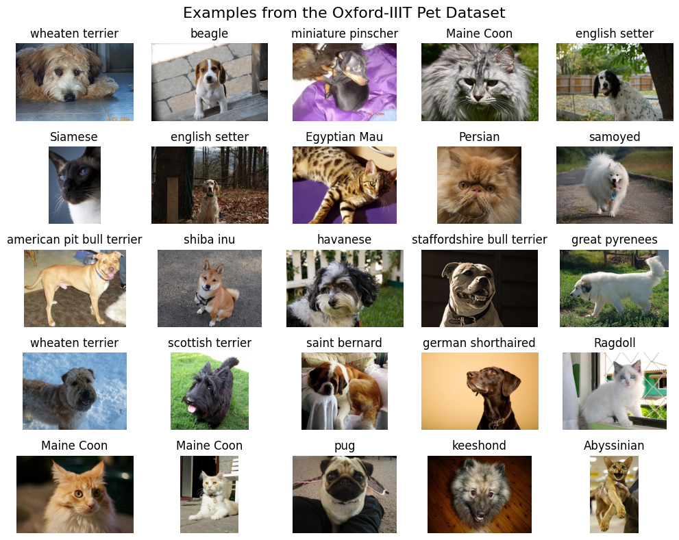
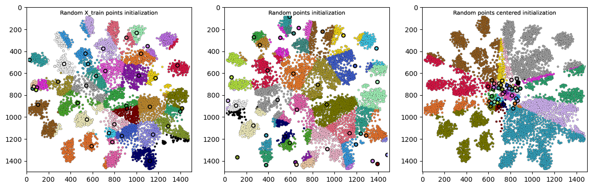
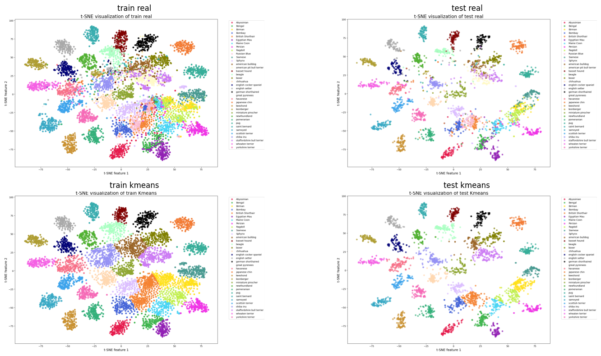

# Clustering Image Embeddings with ViT

## Project Overview

This project demonstrates the application of clustering algorithms (K-means and K-medoids) on image embeddings from the Oxford-IIIT Pet Dataset. We visualize the clustering process and compare the results using various dimensionality reduction techniques.

## Dataset

We use the [Oxford-IIIT Pet Dataset](https://www.robots.ox.ac.uk/~vgg/data/pets/), which contains images of cats and dogs of different breeds, in total 37 classes.

I have created a dataset with embeddings and augentation to increase the number of images 3 times https://huggingface.co/datasets/CristianLazoQuispe/oxford-iiit-pet-aug-embeddings. I used ViT model to generate embeddins 'vit-base-patch16-224-in21k'.

## Repository Structure

    ├── 01.Demo image embeddings.ipynb
    ├── animation_kmeans.gif
    ├── animation_kmeans.mp4
    ├── animation_kmedoids.gif
    ├── animation_kmedoids.mp4
    ├── LICENSE
    ├── README.md
    ├── requirements.txt
    └── train_tsne_kmeans.png

## Key Features

1. **Image Embedding Analysis**: Explore and visualize high-dimensional image embeddings.
2. **Clustering Algorithms**: Implementation and comparison of K-means and K-medoids algorithms.
3. **Dynamic Visualization**: Animated GIFs showing the clustering process for both algorithms.
4. **Dimensionality Reduction**: Application of t-SNE for visualizing high-dimensional data in 2D space.

## Animations

<table>
  <tr>
    <td align="center">K-means Clustering</td>
    <td align="center">K-medoids Clustering</td>
  </tr>
  <tr>
    <td></td>
    <td></td>
  </tr>
</table>

This animation demonstrates the K-medoids algorithm, highlighting how it differs from K-means in selecting cluster centers.

## Getting Started

1. Clone the repository: https://github.com/CristianLazoQuispe/ClusteringImageEmbeddings.git
2. Install the required dependencies:

    pip install -r requirements.txt

3. Open and run the Jupyter notebook:

    jupyter notebook "01.Demo image embeddings.ipynb"

## Results

The `initializations.png` image shows different initializations techniques.

The `results_kmeans.png` image shows the final clustering results using t-SNE for dimensionality reduction and K-means for clustering.

## Future Work

- Implement and compare additional clustering algorithms
- Explore the effect of different embedding techniques on clustering performance
- Analyze cluster quality metrics to evaluate the effectiveness of different approaches

## Contributing

Contributions to this project are welcome. Please feel free to submit a Pull Request.

## License

This project is licensed under the [MIT License](LICENSE).
